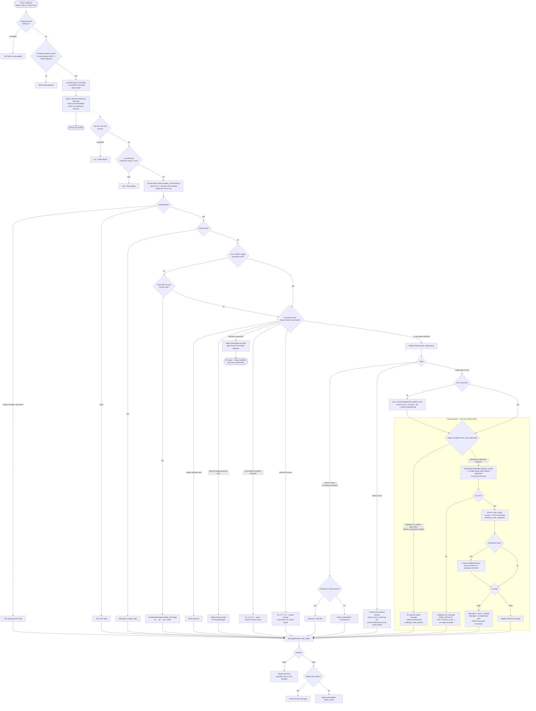
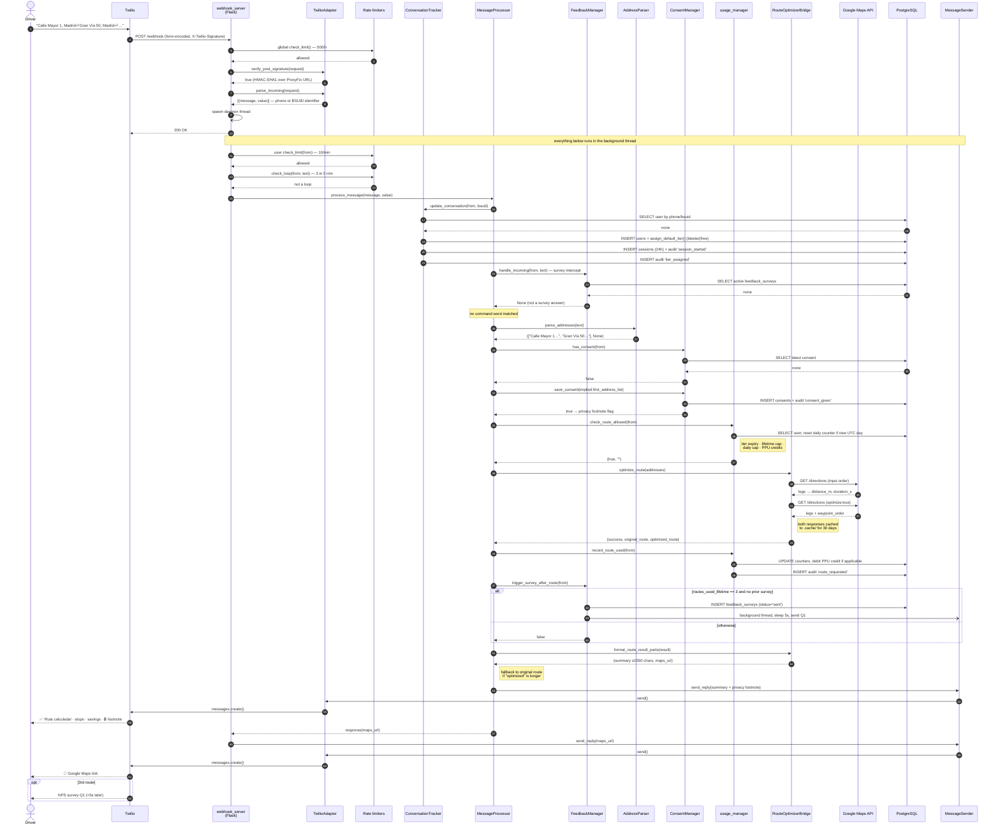
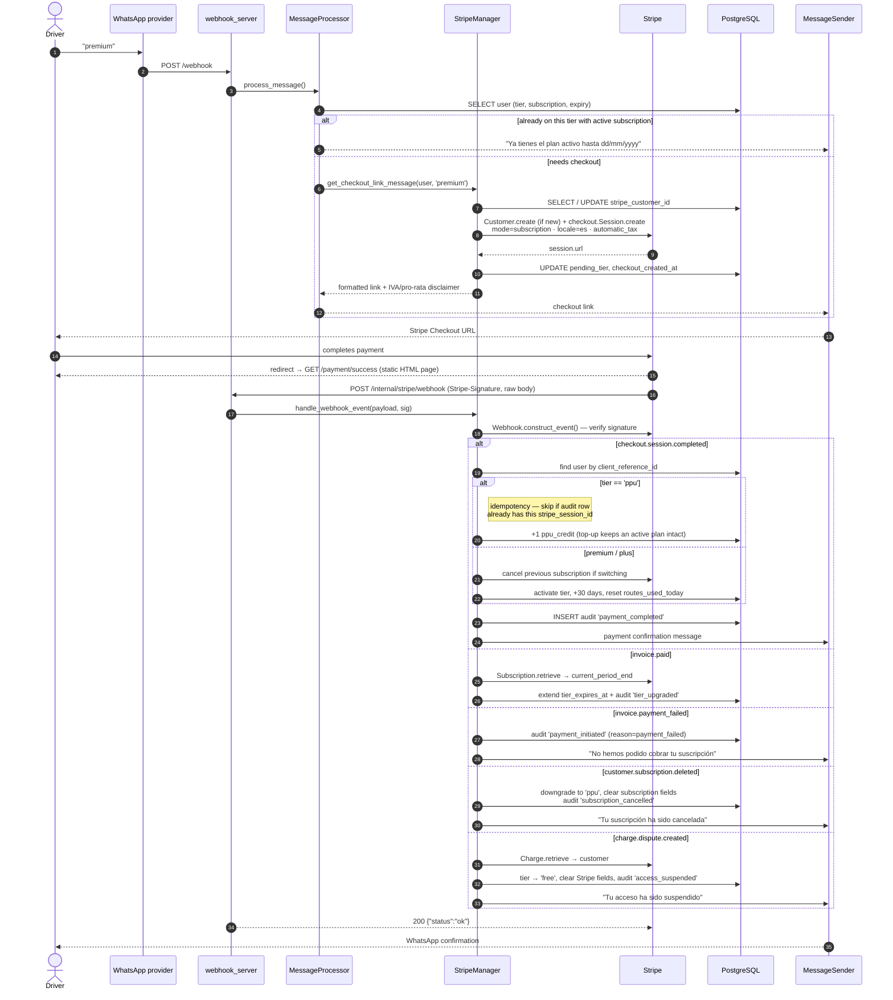

# Mi Ruta Pro — Architecture Diagrams

**Generated:** 2026-09-16 · **Branch:** `gdpr-relax` · **Scope:** whole repository (`wab/`, `route_optimizer/`, `database/`, deploy files)

These diagrams reflect the code as it stands on this branch, including the **implied-consent (GDPR-relax) flow** — there is no longer a blocking consent gate; sending an address list *is* the consent act.

---

## 0. High-level flow — WhatsApp route optimization request

The 10,000-foot view: what happens, component by component, when a driver sends an address list and gets an optimized route back. Detail (rate limits, GDPR branches, command routing) is stripped out here — see section 1 for the full pipeline.

```mermaid
flowchart LR
    U(["👤 Driver<br/>WhatsApp"])

    subgraph PROVIDER ["Messaging provider"]
        WAP["Meta Cloud API<br/>or Twilio Sandbox"]
    end

    subgraph EDGE ["Webhook edge"]
        FLASK["Flask webhook_server<br/>verify signature · dispatch"]
        ADAPT["Provider adapter<br/>normalise payload"]
    end

    subgraph APP ["Application core"]
        MP["MessageProcessor<br/>route request detected"]
        AP["AddressParser<br/>extract address list"]
        UM["usage_manager<br/>tier / quota gate"]
        RB["RouteOptimizerBridge<br/>call optimizer · format reply"]
    end

    subgraph CORE ["route_optimizer"]
        RO["Directions calls (×2)<br/>original + optimized order<br/>+ 30-day file cache"]
    end

    subgraph DATA ["Persistence"]
        PG[("PostgreSQL<br/>user, tier, usage counters")]
    end

    GMAPS[("🗺️ Google Maps<br/>Directions API")]

    MS["MessageSender<br/>pick free-form vs template"]

    U -->|"1. sends address list"| WAP
    WAP -->|"2. webhook POST"| FLASK
    FLASK -->|"3. parse"| ADAPT
    ADAPT -->|"4. normalised message"| MP
    MP -->|"5. parse addresses"| AP
    AP -->|"6. address list"| MP
    MP -->|"7. check quota"| UM
    UM <-->|"read/update tier & counters"| PG
    UM -->|"8. allowed"| MP
    MP -->|"9. optimize(addresses)"| RB
    RB -->|"10. request route"| RO
    RO <-->|"11. cache hit?"| RO
    RO -->|"12. Directions API calls"| GMAPS
    GMAPS -->|"13. distance, duration, order"| RO
    RO -->|"14. route data"| RB
    RB -->|"15. formatted reply<br/>(savings + Maps link)"| MP
    MP -->|"16. record usage"| UM
    MP -->|"17. send reply"| MS
    MS -->|"18. deliver"| ADAPT
    ADAPT -->|"19. provider API call"| WAP
    WAP -->|"20. optimized route"| U

    classDef person fill:#0b4f6c,stroke:#083b52,color:#fff
    classDef ext fill:#6b7280,stroke:#4b5563,color:#fff
    classDef store fill:#4b5563,stroke:#374151,color:#fff
    class U person
    class WAP,GMAPS ext
    class PG store
```

**The five hops that matter:**

1. **Provider → Webhook edge** — Meta (JSON, HMAC-SHA256) or Twilio (form POST, HMAC-SHA1); the adapter pattern means `MessageProcessor` never knows which one it's talking to.
2. **Webhook edge → Application core** — `MessageProcessor` routes to `AddressParser`, which decides this is a route request (not a command, not a greeting).
3. **Application core → Persistence** — `usage_manager` checks the driver's tier/quota against PostgreSQL *before* any Google Maps call is made, so a blocked user never costs API quota.
4. **Application core → `route_optimizer` → Google Maps** — the bridge calls the pure optimizer module twice (input order + Google-optimized order) so savings can be computed; both calls are cached locally for 30 days.
5. **Application core → Provider → Driver** — the formatted reply (stops, savings, Google Maps link) goes back out through the same adapter that received the request, so Meta and Twilio each get delivery formatted their own way (single message vs. two-part split).

---

## 1. Flow diagram — inbound message pipeline

Every inbound WhatsApp message travels this path. The dashed box is the only place where money, Google Maps quota and the route result are involved.

**Key invariants visible above**

- Usage is recorded **only** after a successful optimization — errors and bad addresses never cost the user a route or a credit.
- Parse errors short-circuit *before* `check_route_allowed`, because a brand-new user has no DB row yet (commit `0fe309b`).
- GDPR and billing command words bypass the survey interceptor, so a user mid-survey can still revoke or delete.

---

## 2. C4 component diagram — Level 3, inside the webhook container

One deployable container (Gunicorn, 1 worker, Railway) holds all components. Boundaries below are Python packages.

```mermaid
flowchart TB
    %% ---------- People & external systems ----------
    USER(["👤 Delivery driver<br/><i>Person</i><br/>Sends address lists over WhatsApp"])

    subgraph EXT ["External systems"]
        direction LR
        WA["WhatsApp<br/><i>Meta Cloud API</i><br/>graph.facebook.com/v18.0"]
        TW["WhatsApp<br/><i>Twilio Sandbox</i><br/>twilio.rest.Client"]
        GM["Google Maps<br/><i>Directions API</i><br/>waypoint optimization"]
        ST["Stripe<br/><i>Checkout + Billing</i><br/>PPU / Premium / Plus"]
    end

    subgraph DATASTORES ["Data stores"]
        direction LR
        PG[("PostgreSQL<br/><i>Railway</i><br/>users · consents · sessions<br/>audit_logs · feedback_surveys")]
        FSCACHE[("Local filesystem<br/><i>.cache/*.json</i><br/>30-day Directions cache")]
        LOGS[("Rotating log files<br/><i>wab/logs/</i>")]
    end

    %% ---------- The container ----------
    subgraph CONTAINER ["Container: Mi Ruta Pro webhook app — Python 3.11 · Flask + Gunicorn (1 worker) · Railway"]
        direction TB

        subgraph EDGE ["wab/app · HTTP edge"]
            FLASK["webhook_server<br/><i>Flask app</i><br/>GET/POST /webhook · /health · /<br/>/internal/stripe/webhook<br/>/payment/success · /payment/cancel<br/>ProxyFix · thread per message"]
        end

        subgraph LIM ["wab/utils · protection"]
            RL["RateLimiter<br/><i>in-memory</i><br/>10 msg/min per user"]
            LD["MessageLoopDetector<br/><i>in-memory</i><br/>3 identical / 5 min"]
            GRL["GlobalRateLimiter<br/><i>in-memory</i><br/>500 msg/hour"]
            CLEAN["cleanup thread<br/><i>daemon, hourly</i>"]
        end

        subgraph PROV ["wab/providers · adapter pattern"]
            FACTORY["get_provider()<br/><i>factory</i><br/>reads MESSAGING_PROVIDER"]
            META["MetaAdapter<br/>JSON · HMAC-SHA256 · GET challenge"]
            TWIL["TwilioAdapter<br/>form POST · HMAC-SHA1 · BSUID support"]
        end

        subgraph CORE ["wab/app · orchestration"]
            MP["MessageProcessor<br/><i>God class, ~860 lines</i><br/>command router · GDPR handlers<br/>route orchestration"]
            MS["MessageSender<br/>free-form vs template decision"]
            AP["AddressParser<br/>line / numbered formats<br/>ES road types · ZIP · dedupe · round trip"]
            UM["usage_manager<br/>tier config · route gate<br/>counters · superuser bypass"]
            CM["ConsentManager<br/><i>DB-backed</i><br/>Art. 7 / 15 / 17 / 20"]
            FM["FeedbackManager<br/>NPS survey state machine (q1→q3)"]
            SM["StripeManager<br/><i>sole Stripe boundary</i><br/>checkout · webhook dispatch"]
        end

        subgraph SUP ["wab/utils + wab/config + wab/templates"]
            CT["ConversationTracker<br/><i>DB-backed</i><br/>24h window · Session upsert"]
            CFG["Config / constants<br/>env vars · emails · URLs"]
            TPL["templates<br/>privacy policy · consent copy"]
            LOG["logger<br/>rotating file + console"]
        end

        subgraph BRIDGE ["wab/integration"]
            RB["RouteOptimizerBridge<br/><i>singleton</i><br/>calls optimizer · formats for WhatsApp<br/>1600-char splitting · fallback if worse"]
        end

        subgraph RO ["route_optimizer · pure logic, no WhatsApp knowledge"]
            ROAPI["api<br/>get_route_with_waypoints()<br/>optimize_route() — 2 calls"]
            ROCACHE["cache<br/>MD5 key · 30-day expiry"]
            ROUTIL["utils<br/>fuel cost · duration · Maps URL"]
            ROCLI["main / input_handler<br/><i>CLI path only</i>"]
        end

        subgraph DB ["database · persistence"]
            DBM["DatabaseManager<br/>pool 10+20 · pre-ping · recycle 1h<br/>get_session() context manager"]
            MODELS["ORM models<br/>User · Consent · Session<br/>AuditLog · FeedbackSurvey"]
        end
    end

    %% ---------- Relationships ----------
    USER -->|"messages"| WA
    USER -->|"messages"| TW
    USER -->|"pays"| ST
    WA -->|"webhook POST"| FLASK
    TW -->|"webhook POST"| FLASK
    ST -->|"checkout.session.completed<br/>invoice.paid · dispute.created"| FLASK

    FLASK --> GRL
    FLASK --> RL
    FLASK --> LD
    CLEAN -.->|"prunes hourly"| RL
    CLEAN -.->|"prunes hourly"| LD
    FLASK --> FACTORY
    FACTORY --> META
    FACTORY --> TWIL
    FLASK -->|"verify + parse"| META
    FLASK -->|"verify + parse"| TWIL
    FLASK -->|"process_message()"| MP
    FLASK -->|"send_reply()"| MS
    FLASK -->|"handle_webhook_event()"| SM

    MP --> AP
    MP --> CT
    MP --> CM
    MP --> UM
    MP --> FM
    MP --> SM
    MP --> RB
    MP --> TPL
    MP --> CFG
    MP -->|"Twilio: sends part 1 itself"| MS
    FM -->|"Q1 after 5s, background thread"| MS
    SM -->|"payment confirmations"| MS
    CM -->|"assign_default_tier()"| UM
    CT -->|"assign_default_tier()"| UM
    UM -->|"upsell links"| SM

    MS --> META
    MS --> TWIL
    META -->|"HTTPS"| WA
    TWIL -->|"HTTPS"| TW

    RB --> ROAPI
    RB --> ROUTIL
    ROAPI --> ROCACHE
    ROAPI -->|"HTTPS GET ×2"| GM
    ROCACHE <-->|"read/write JSON"| FSCACHE
    ROCLI --> ROAPI

    CM --> DBM
    CT --> DBM
    UM --> DBM
    FM --> DBM
    SM --> DBM
    MP --> DBM
    DBM --> MODELS
    DBM <-->|"SQLAlchemy / psycopg2"| PG
    SM <-->|"REST"| ST
    LOG --> LOGS

    classDef person fill:#0b4f6c,stroke:#083b52,color:#fff
    classDef ext fill:#6b7280,stroke:#4b5563,color:#fff
    classDef store fill:#4b5563,stroke:#374151,color:#fff
    class USER person
    class WA,TW,GM,ST ext
    class PG,FSCACHE,LOGS store
```

**Notes**

- `route_optimizer/` has **no** dependency on `wab/` — the bridge is the only seam. The CLI (`run_optimizer.py`) uses the same core.
- Rate-limiter state is **per process and in memory**: it resets on deploy and would not be shared if the worker count ever rose above 1.
- The legacy JSON implementations (`wab/app/consent_manager.py`, `wab/utils/conversation_tracker.py`, `wab/utils/encryption.py`) are **not wired into the running app** — only their `_db` counterparts are. They remain reachable from `wab/scripts/` migration tools.

---

## 3. Sequence diagram — first route request (implied consent, Twilio)

The heaviest path in the system: new user, no DB row, sends addresses, gets a two-part reply.

### 3b. Sequence — Stripe payment and tier activation

---

## Data lifecycle (GDPR), for reference

| Table | Retention | Cleanup |
|---|---|---|
| `users` | soft-deleted / anonymized on Art. 17 request | `User.anonymize()` — 14-digit placeholder, PII and Stripe fields cleared |
| `consents` | 3 years (Art. 7 burden of proof) | `cleanup_expired_data()` PG function |
| `sessions` | 24h window, deleted at 48h | `cleanup_expired_data()` PG function |
| `audit_logs` | 90 days, `user_id` set NULL on delete | `cleanup_expired_data()` PG function |
| addresses | never persisted — in memory for the request only | n/a |
| `.cache/*.json` | 30 days, contains address strings | expiry check on read |

> `cleanup_expired_data()` is exposed through `DatabaseManager.execute_cleanup()` but is **not** scheduled from inside the app — it needs an external cron/Railway job.

---

## Deployment topology

| | |
|---|---|
| Production | Railway · NIXPACKS · `gunicorn wab.app.webhook_server:app --workers 1 --timeout 120` |
| Local dev | `python wab/run_webhook.py` + `ngrok http 5000` |
| CLI | `python run_optimizer.py ["addr" …]` — reads `input.txt`, bypasses the whole `wab/` stack |
| Runtime | Python 3.11.7 · Flask 3.0 · SQLAlchemy 2.0 · stripe 11.4 · twilio 9.10 |
| Provider switch | `MESSAGING_PROVIDER=meta\|twilio` — no code change |
